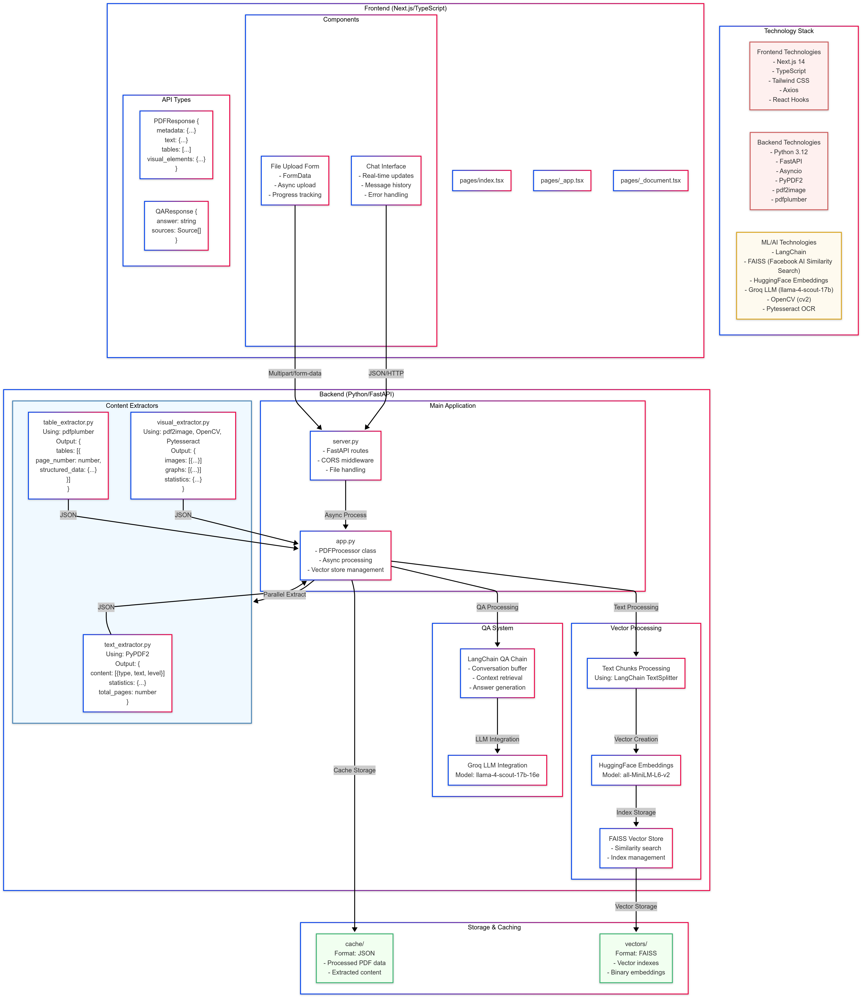

# PDF Analysis and Question Answering System

A full-stack application that processes PDF documents, extracts various types of content (text, tables, images/graphs), and provides an intelligent question-answering interface using LLM technology.

## System Architecture



## Features

- 📄 PDF Processing with multi-content type extraction
- 📊 Intelligent table structure recognition
- 🖼️ Image and graph extraction with OCR
- 💬 Advanced question answering using Groq LLM
- 🔍 Vector-based semantic search
- ⚡ Real-time chat interface

## Tech Stack

### Frontend
- Next.js 14
- TypeScript
- Tailwind CSS
- Axios for API communication

### Backend
- Python 3.12
- FastAPI
- Asyncio for concurrent processing
- PDF Processing:
  - PyPDF2
  - pdf2image
  - pdfplumber
  - OpenCV
  - Pytesseract OCR

### ML/AI
- LangChain for QA chain
- FAISS for vector storage
- HuggingFace Embeddings (all-MiniLM-L6-v2)
- Groq LLM (llama-4-scout-17b)

## Setup Instructions

### Prerequisites
- Python 3.12+
- Node.js 18+
- Tesseract OCR
- Git

### Environment Setup

1. **Clone the repository**
   ```bash
   git clone <repository-url>
   cd pdf-ans
   ```

2. **Backend Setup**
   ```bash
   # Create and activate virtual environment
   python -m venv venv
   source venv/bin/activate  # On Windows: .\venv\Scripts\activate

   # Install root dependencies
   pip install -r requirements.txt

   # Navigate to backend directory and install dependencies
   cd backend
   pip install -r requirements.txt

   # Create .env file in backend directory
   # Add your Groq API key to .env:
   # GROQ_API_KEY=your_api_key_here
   ```

3. **Frontend Setup**
   ```bash
   # Navigate to frontend directory
   cd frontend

   # Install dependencies
   npm install

   # Check if all required dependencies are installed
   npm list next react react-dom typescript

   # Install additional UI dependencies if needed
   npm install framer-motion lucide-react react-dropzone

   # Verify the frontend configuration
   npm run lint
   ```

   Note: The frontend includes:
   - Next.js 14 with TypeScript configuration
   - TailwindCSS for styling
   - React 18+ components
   - File upload handling with react-dropzone
   - UI animations with framer-motion

4. **Install Tesseract OCR**
   - Windows: Download and install from [Tesseract GitHub](https://github.com/UB-Mannheim/tesseract/wiki)
   - Linux: \`sudo apt-get install tesseract-ocr\`
   - Mac: \`brew install tesseract\`

### Running the Application

1. **Start the Backend Server**
   ```bash
   # Navigate to backend directory
   cd backend

   # Activate virtual environment
   ..\venv\Scripts\activate  # On Windows
   # source ../venv/bin/activate  # On Unix/Mac

   # Install requirements if not already done
   pip install -r requirements.txt

   # Run the FastAPI server
   uvicorn server:app --reload --host 0.0.0.0 --port 7860
   ```

2. **Start the Frontend Development Server**
   ```bash
   # From the frontend directory
   npm run dev
   ```

3. **Access the Application**
   - Frontend: `http://localhost:3000`

## Project Structure

```
pdf-ans/
├── backend/           # Backend directory
│   ├── app.py        # Main PDF processing logic
│   ├── server.py     # FastAPI server
│   ├── text_extractor.py   # Text extraction module
│   ├── table_extractor.py  # Table extraction module
│   ├── visual_extractor.py # Image/graph extraction module
│   ├── requirements.txt    # Backend dependencies
│   ├── .env          # Environment variables
│   ├── cache/        # Cache directory for processing
│   └── extracted_data/     # Extracted content storage
├── frontend/         # Next.js frontend
│   ├── pages/       # Next.js pages
│   │   ├── _app.tsx
│   │   ├── _document.tsx
│   │   └── index.tsx
│   ├── styles/      # CSS styles
│   ├── package.json # Frontend dependencies
│   └── node_modules/
├── docs/            # Documentation
├── venv/            # Python virtual environment
├── requirements.txt # Root level dependencies
└── .gitignore      # Git ignore file
```

## API Endpoints

### POST /upload
Uploads and processes a PDF file.
- Request: \`multipart/form-data\` with PDF file
- Response: JSON with extracted content structure

### POST /ask
Submits a question about the processed PDF.
- Request: JSON with question and chat history
- Response: JSON with answer and source references

## Data Structures

### PDF Processing Response
```json
{
    "metadata": {
        "filename": string,
        "processed_at": string,
        "file_size": number,
        "total_pages": number
    },
    "text": {
        "content": [
            {
                "type": "paragraph" | "heading",
                "text": string,
                "level": number
            }
        ]
    },
    "tables": [
        {
            "page_number": number,
            "structured_data": object
        }
    ],
    "visual_elements": {
        "images": [...],
        "graphs": [...]
    }
}
```

### Question-Answer Response
```json
{
    "answer": string,
    "sources": [
        {
            "type": "text" | "table" | "image" | "graph",
            "page": number,
            "content": string
        }
    ]
}
```

## Contributing

1. Fork the repository
2. Create your feature branch (\`git checkout -b feature/AmazingFeature\`)
3. Commit your changes (\`git commit -m 'Add some AmazingFeature'\`)
4. Push to the branch (\`git push origin feature/AmazingFeature\`)
5. Open a Pull Request

## Acknowledgments

- LangChain for the QA framework
- Groq for LLM API access
- HuggingFace for embeddings model
- Facebook Research for FAISS
